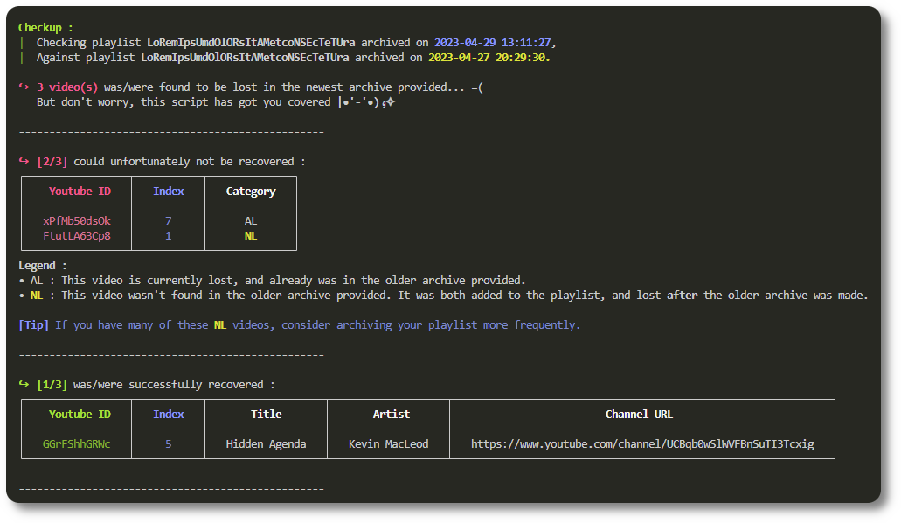
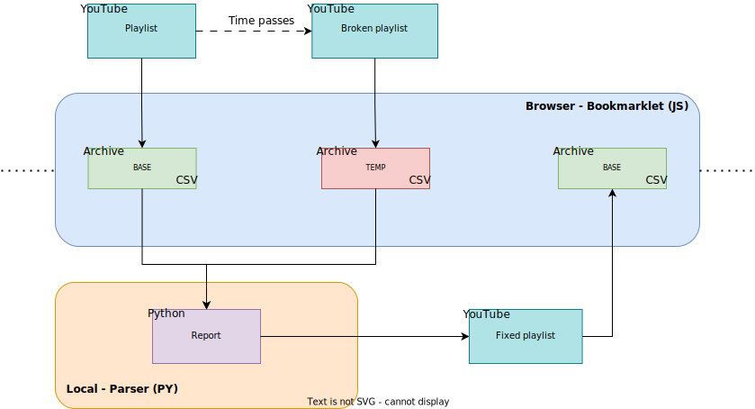

# yt-playlist-bookmarklet
<p align="center">
  <a href="https://youtube.com">
    </a>
  <a href="https://python.org/downloads">
    </a>
  <a href="https://github.com/vitto4/yt-playlist-bookmarklet/releases">
    </a>
  

</p>

<p align="center"><i>A youtube playlist archiver bookmarklet, and its companion archive parser tool.</i></p>



## 🏮 Index
1. [Overview](#-overview)
2. [Installation](#-installation)
3. [Usage](#-usage)
4. [Additional notes](#-additional-notes)
5. [Contributing](#-contributing)


## ☁ Overview

When a video goes private or is deleted, it will appear as such in youtube playlists, making it difficult for the user to figure out what the original video was.

This project is my attempt at solving the problem. It consists of :
- A bookmarklet `src/bookmarklet.js`. It will dump/export for you the contents of any youtube playlist you can view through your browser. Outputs a `csv` archive.
- A parser script `src/list_parser.py` to quickly analyse (diff) two archives of the same playlist. It will compile a list of all videos that went missing, along with their original title and channel if available in the older archive.

All in all, it should enable you to export a youtube playlist in `csv` format (see example bellow), and hopefully to keep track of which video disappears over the course of time.

The major advantage of this approach is that it'll work regardless of whether the playlist is set to public or private.

Here's an example of the structure of an archive :

```csv
Playlist ID : LOremipSUmdolOrsiTamEtConseCtETuRA
Archived on : 1704067200000
index, id, isUnavailable, artist, artistUrl, title
1, GGrFShhGRWc, True, "Unknown artist", "Unknown link", "[Deleted video]"
2, dQw4w9WgXcQ, False, "Rick Astley", "https://www.youtube.com/channel/UCuAXFkgsw1L7xaCfnd5JJOw", "Rick Astley - Never Gonna Give You Up (Official Music Video)"
3, ...
```


## 💾 Installation

### Bookmarklet

This is the piece of code that will interact with the youtube frontend.

To get it set up quickly, I suggest copying the contents of `src/bookmarklet.js` into [make-bookmarklets.com](https://make-bookmarklets.com/), clicking *create bookmarklet*, and dragging the red button to your bookmark bar.

If you want to install it manually and don't know how to proceed (or are just curious), [this](https://www.freecodecamp.org/news/what-are-bookmarklets/) is the way to go. Please note that if you do it this way, you may have to strip all comments from the code for it to work properly

### Parser

A tool made to help you analyse and compare your archives.

Make sure you have [Python](https://www.python.org/downloads/) installed, grab the latest [release](https://github.com/vitto4/yt-playlist-bookmarklet/releases), and unzip it.

For dependencies you can use a [venv](https://docs.python.org/3/tutorial/venv.html). If you're on linux :

```sh
$ python3 -m venv plist
$ source plist/bin/activate
(env) $ pip install -r requirements.txt
```
Or for windows :
```bat
> py -m venv plist
> plist\Scripts\activate.bat
(env) > pip install -r requirements.txt
```

## 📚 Usage

### General workflow



### Archiving a playlist

1. **Open the playlist** you want to archive. The url should look something like `youtube.com/playlist?list=<PlaylistID>`
2. **Reload the page**. This is important, as it seems youtube sometimes keeps the previous page's data in the html source of the current page. TL;DR, if you don't reload, you may find unwanted videos in your archive.
3. If applicable, **click on the three dots** to the left of the page and **select « Show unavailable videos »**. If it's not showing up even though your playlist contains unavailable videos, try to *Sort by* something else, reload the page, and restore your preferred sorting.
4. **Scroll all the way down**. This is needed as it forces youtube to load the whole playlist in your browser. **This can also be done automatically by the bookmarklet** (see next step).
5. **Click the bookmarklet**. (It should already be in your bookmark bar by now, if not, see [💾 Installation](#-installation).)
6. **Save the file**, keep it somewhere, this is the final product, and it'll come in handy later. (see [Recovering videos](#recovering-videos))

### Recovering videos

1. Make sure you have an older, **clean archive** of your playlist. We'll call it *BASE*
2. **Make a temporary archive** of your playlist (I'll refer to it as *TEMP*). Also make sure to have youtube display unavailable videos in you playlist beforehand. (see [Archiving a playlist, step 3.](#archiving-a-playlist))
3. **Run** the script :

```sh
$ python3 list_parser.py <path_to_base>.csv <path_to_temp>.csv
```

When you're done recovering videos, **don't forget to make new clean archive of your playlist for future use**, this will be your *BASE* next time. (see [General workflow](#general-workflow)).

## 🔖 Additional notes

The JS bookmarklet is a *(very)* heavily modified version of [AI Max's code](https://www.quora.com/Is-there-a-way-to-save-the-video-titles-from-a-YouTube-playlist-and-SoundCloud-likes-into-a-text-file-or-some-other-file/answer/Al-Max-2) on Quora.

I initially made this for my own use, but I hope it can be useful to others as well :)

You can probably tell that I don't really know what I'm doing with JS haha, feel free to PR if you want to fix anything.

Also, the comments, readme, and `CHANGELOG.md` are probably a bit overkill for such a small project, but I figured it was a great way to learn github releases, semantic versioning and what not.

I had a surprisingly hard time to try and explain how to actually use my code, this is when I decided to make the [workflow diagram](#general-workflow), hopefully it clears things up a bit !

## 🧩 Contributing

Contributions are welcome ! The bookmarklet will probably need frequent maintenance as youtube seem to like making slight adjustments to their frontend pretty often ﹥∼﹤